# 基础Server
ziface 主要是存放一些 Zinx 框架的全部模块的抽象层接口类，Zinx 框架的最基本的是服务类接口 iserver，
定义在 ziface 模块中。

znet 模块是 zinx 框架中网络相关功能的实现，所有网络相关模块都会定义在 znet 模块中。

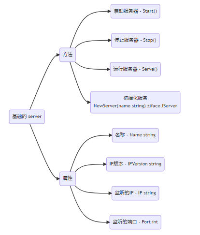

# 简单的连接封装和业务绑定

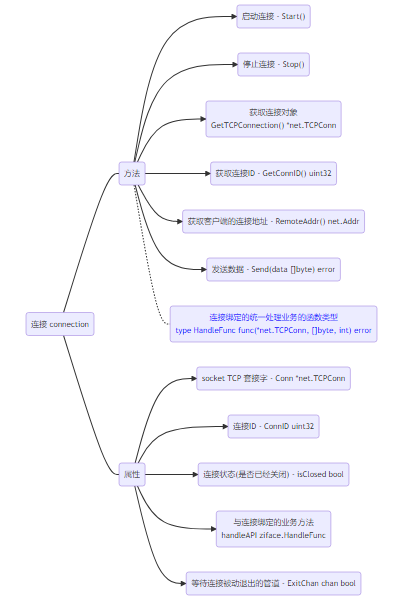

# 基础 router 模块

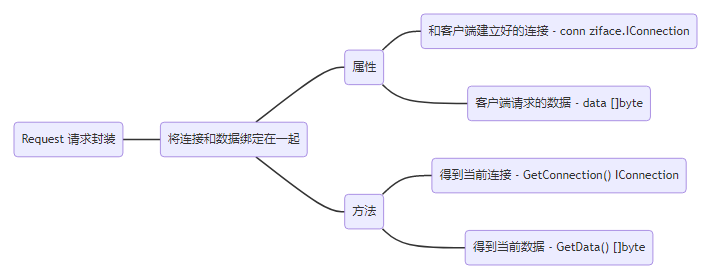

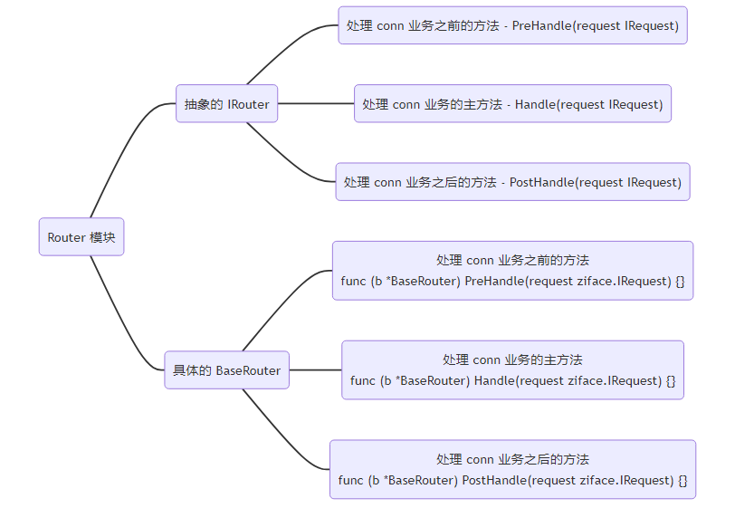

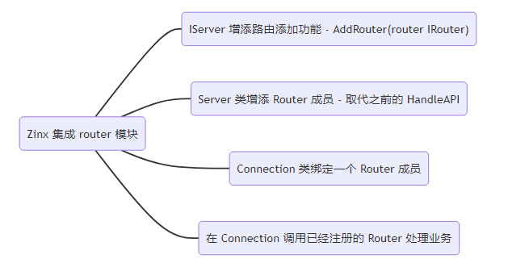

# 全局配置
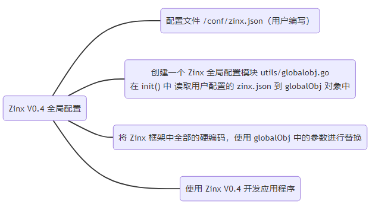

# 消息封装
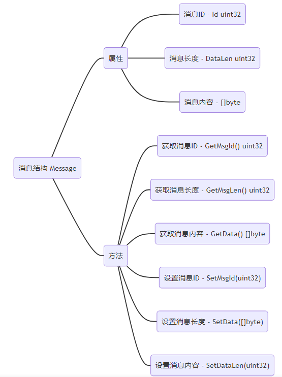

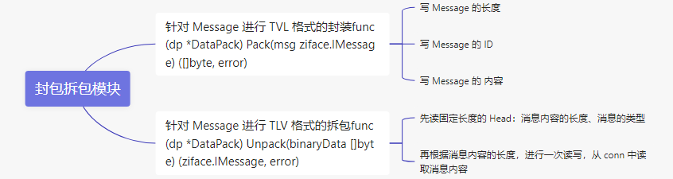

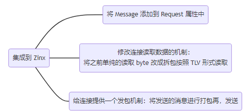

# 多路由
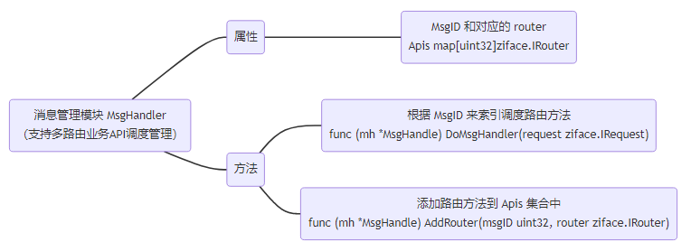

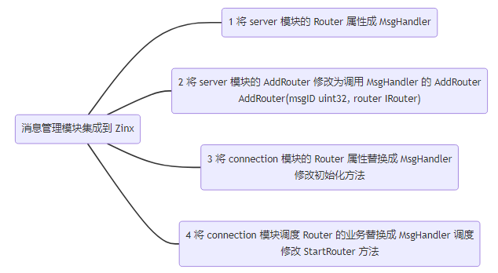